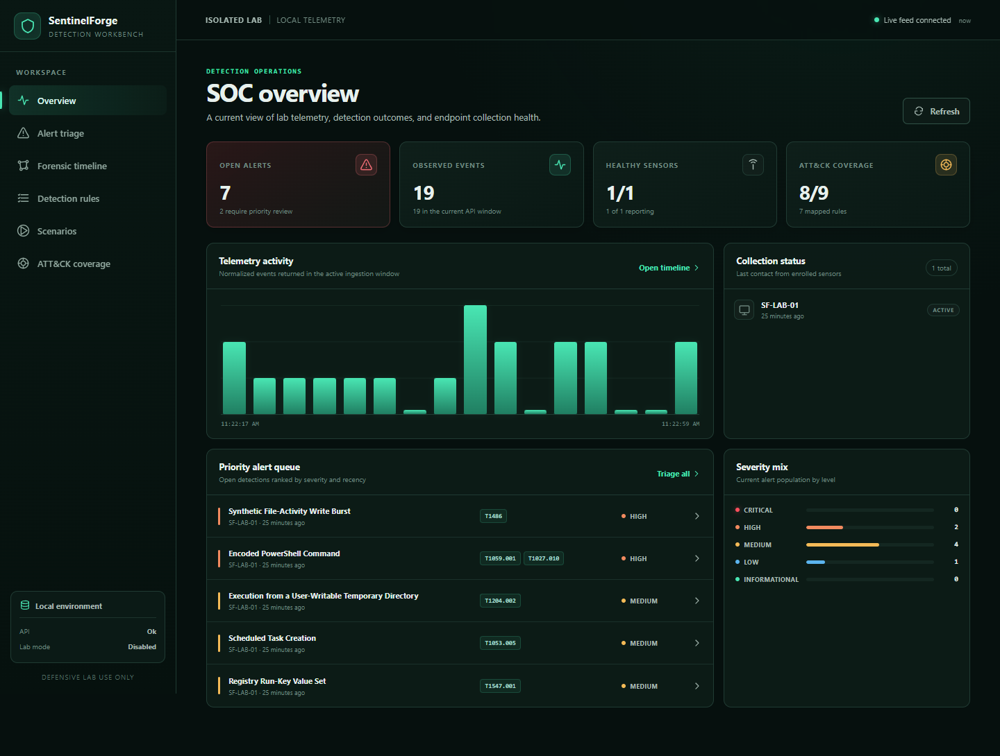
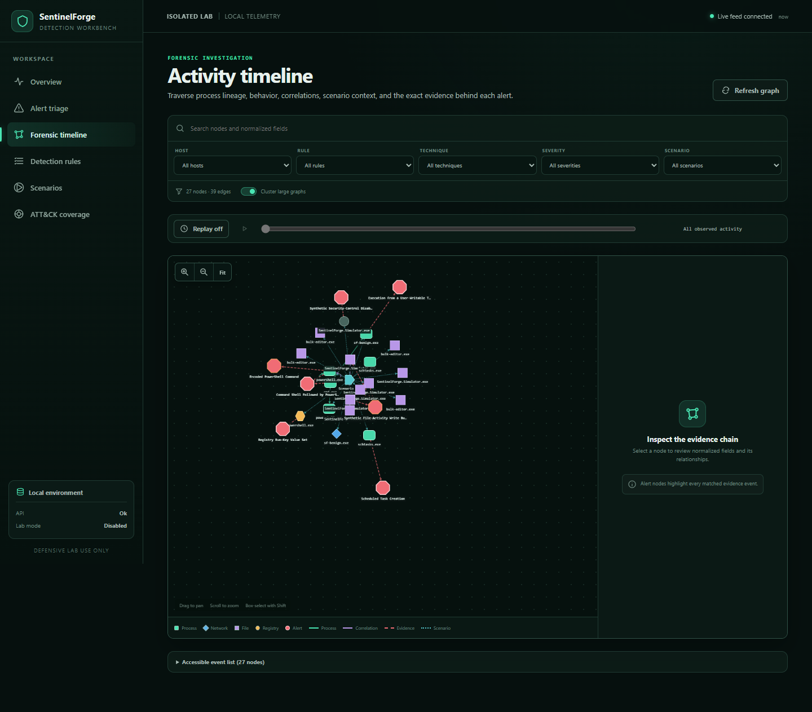
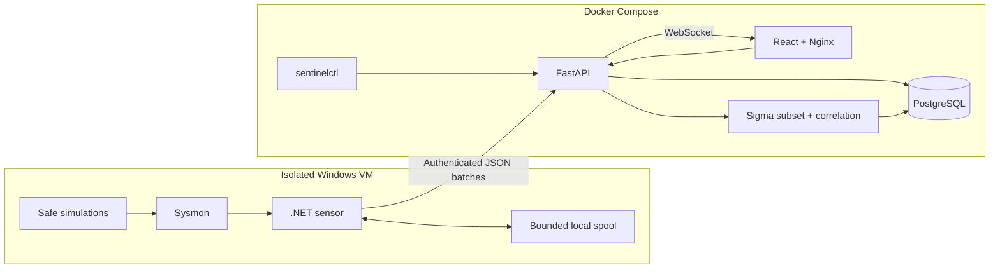

# SentinelForge

SentinelForge is a Docker-first defensive security lab for safe adversary simulation, Windows endpoint telemetry, and detection engineering. It connects a small set of reversible lab behaviors to deterministic rules, explainable alerts, and a graph-based investigation dashboard.

[Explore the project page](https://hmmckay.github.io/SentinelForge/) · [Architecture](docs/architecture.md) · [Validation record](docs/validation-report.md) · [Run locally](#containerized-setup)

The core stack is Docker-first and also works without Windows. A seeded demo produces realistic process, file, registry, DNS, network, and control-change events—including positive cases and near misses—so rule behavior and the forensic timeline can be reviewed reproducibly.

The goal is to make the entire detection path inspectable: what happened, why a rule fired, which events support it, and whether the result can be reproduced. This is an independent, AI-assisted hobby project with a deliberately bounded lab scope, not a production EDR or SIEM.

## What it does

- Enrolls Windows sensors and accepts authenticated, idempotent event batches.
- Normalizes Sysmon-like activity into a strict versioned schema.
- Stores investigation-friendly event fields and process lineage in PostgreSQL.
- Loads a validated Sigma subset and rejects unsupported semantics instead of approximating them.
- Correlates thresholds and ordered behaviors across time windows and grouping keys.
- Produces alerts with matched fields, evidence events, ATT&CK mapping, confidence, severity, false-positive notes, and investigation guidance.
- Runs deterministic demo datasets with both detections and near misses.
- Provides a SOC overview, alert triage, rule explorer, safe scenario catalog, ATT&CK coverage view, and graph forensic timeline.
- Supports lab-gated, dry-run, reversible Windows simulations with cleanup manifests and verification.
- Exposes common operations through `sentinelctl`.

## Dashboard

These are real captures from the containerized stack after seeding the deterministic `1337` dataset; they are not design mockups.





## Architecture



I kept ingestion, detection, correlation, scenario bookkeeping, queries, and live notifications in one modular FastAPI service. At this scale, a broker and separate workers would create more ordering and operational problems than they solve. The sensor and frontend remain separate because their platform and privilege boundaries are real. [Architecture details](docs/architecture.md) and [ADRs](docs/adr/) record the tradeoffs.

### Components

| Component | Implementation | Responsibility |
|---|---|---|
| API | Python, FastAPI, Pydantic, SQLAlchemy | Enrollment, ingestion, validation, normalization, rules, correlation, alerts, queries, export, retention |
| Database | PostgreSQL | Sensors, hosts, events/projections, processes, rules/versions, alerts/evidence, correlations, scenarios/runs, ATT&CK techniques |
| Dashboard | React, TypeScript, Vite, Nginx | Operational views, triage, rule/scenario workflows, coverage, graph timeline, live refresh |
| Windows sensor | .NET 8 worker | Sysmon Event Log reads, normalization, batching, bounded retry/spool, DPAPI-protected identity, health |
| Simulations | PowerShell | Fixed allowlisted lab behaviors, dry-run, cleanup manifests, containment and verification |
| CLI | Python/Typer | Health, sensor listing, scenario runs, demo seed, rule validation, investigation export, purge |

## Containerized setup

Prerequisites:

- Docker Desktop or Docker Engine with Compose v2
- PowerShell 7 for the bootstrap helper (or create `.env` manually)
- Permission to build and run local containers; no separate database or Python installation is required

The preferred one-command setup generates ignored local secrets, validates Compose, builds, and starts the stack:

```powershell
./scripts/bootstrap.ps1
```

Then open [http://127.0.0.1:8080](http://127.0.0.1:8080). The API health endpoint is [http://127.0.0.1:8000/health](http://127.0.0.1:8000/health), and local OpenAPI documentation is at [http://127.0.0.1:8000/api/docs](http://127.0.0.1:8000/api/docs).

To use the literal Compose workflow on a clean checkout:

```powershell
Copy-Item .env.example .env
# Replace every change-this-* value with an independent URL-safe random secret.
docker compose up --build -d
docker compose ps
```

Services bind to loopback by default. PostgreSQL has no host-published port and is attached to an internal network. Do not change `SENTINELFORGE_BIND_ADDRESS` for convenience unless the host firewall, TLS termination, lab isolation, and access model have been reviewed.

Stop while retaining data:

```powershell
docker compose down
```

`docker compose down --volumes` permanently removes the lab database. Confirm the Compose project before using it.

## Demo mode (no Windows required)

Seed a deterministic dataset through the on-demand CLI container:

```powershell
docker compose --profile tools run --rm sentinelctl demo seed --seed 1337
```

The same seed uses stable identifiers and is idempotent. It includes realistic host/user/process relationships, ATT&CK-tagged behaviors, rule positives, and plausible near misses. It is synthetic telemetry; the UI labels it that way.

A useful review path is:

1. Start on Overview and confirm service/event/alert state.
2. Open an alert and inspect its explanation and exact evidence.
3. Compare the related near miss in the event data.
4. Open Timeline, filter by technique or rule, and select the alert node.
5. Replay the evidence chain in event-time order.
6. Review implemented versus observed coverage in ATT&CK Coverage.

The longer walkthrough is in [docs/demo.md](docs/demo.md).

## Windows sensor

The sensor runs on the Windows VM rather than inside the Linux Compose stack. That is necessary for real Event Log and DPAPI access.

At a high level:

1. Install and configure Sysmon separately in a disposable isolated VM.
2. Build or publish the worker under `agent/`.
3. Set the API URL and one-time enrollment key through the documented configuration mechanism.
4. Run in console mode first and confirm enrollment, health, and spool behavior.
5. Install as a Windows service using a dedicated least-privilege identity with Event Log read access.

The sensor spools before delivery, retries with bounded exponential backoff and jitter, caps disk use, and treats authentication/schema failures as degraded health rather than retry storms. If an outage exceeds the configured spool capacity, it drops the oldest pending complete batch and reports that loss; the disk bound is not a claim of lossless collection. Its event source is abstracted so normalization and delivery can be tested without claiming a real Sysmon integration run. See [agent/README.md](agent/README.md) for exact commands and service guidance.

## Safe simulations

Live scenarios require `SENTINELFORGE_LAB_MODE=1`. The API gate does not replace the independent Windows runner gate. Every scenario also supports dry-run, constrains its target, writes a cleanup manifest, and verifies cleanup.

Included behaviors:

- a Run-key-shaped value beneath a SentinelForge-owned non-autostart registry path
- SentinelForge-named scheduled task
- benign process lineage
- benign encoded PowerShell text output
- execution from a scenario-owned user-writable sandbox
- DNS resolution plus localhost-only interaction
- ransomware-like rename/write behavior only against files created in a synthetic corpus
- synthetic security-control modification telemetry

The framework does not accept arbitrary scripts, targets, registry keys, task names, or remote destinations from the dashboard. Start with dry-run inside a disposable VM snapshot:

```powershell
$env:SENTINELFORGE_LAB_MODE = '1'
pwsh -NoProfile -File simulations/Invoke-SentinelForgeScenario.ps1 -ScenarioId benign-process-chain -DryRun
```

Review [simulations/README.md](simulations/README.md) and each scenario's documentation before removing `-DryRun`.

## Detection model

The normalized event schema is the interface between collection and detection. It carries event/ingest timestamps, host and sensor identity, process lineage, network/file/registry fields, raw-event reference, scenario run ID, ATT&CK tags, and a bounded metadata extension point. The contract borrows familiar ideas from ECS and OCSF but does not claim conformance. See [schemas/normalized-event-v1.schema.json](schemas/normalized-event-v1.schema.json).

The stateless engine supports a documented Sigma-like subset: named selections, normalized-field equality/lists, allowlisted string modifiers, and boolean conditions. Unsupported aggregations, pipelines, backend-specific behavior, or ambiguous operators fail validation. The stateful layer adds time-windowed thresholds/sequences, grouping, and deduplication.

An alert is not just a title and timestamp. It retains the rule/version, explanation, matched fields, event evidence, ATT&CK technique, confidence/severity, false-positive context, and investigation guidance. Rule files and per-rule notes live under `detections/`; authoring guidance is in [docs/detection-authoring.md](docs/detection-authoring.md).

## Forensic timeline

The timeline is the primary investigation view. It represents process lineage, activity, alert evidence, correlation, and scenario membership as typed edges—not as relationships inferred from visual proximity.

It supports:

- zoom, pan, fit, node inspection, and keyboard-accessible controls
- host, rule, technique, severity, scenario, and time filters
- evidence-chain highlighting from a selected alert
- event-time replay with pause/scrub controls
- deterministic clustering for large sibling/event sets
- bounded server queries with truncation metadata

Selecting an alert emphasizes the exact evidence referenced by the stored alert. Replay changes visibility; it does not re-run detection or rewrite history. [docs/timeline.md](docs/timeline.md) explains the data and performance boundary.

## `sentinelctl`

Run it without keeping a CLI container alive:

```powershell
docker compose --profile tools run --rm sentinelctl health
docker compose --profile tools run --rm sentinelctl sensors list
docker compose --profile tools run --rm sentinelctl scenarios run benign-process-chain
docker compose --profile tools run --rm sentinelctl demo seed --seed 1337
docker compose --profile tools run --rm sentinelctl rules validate
docker compose --profile tools run --rm sentinelctl export investigation --output -
docker compose --profile tools run --rm sentinelctl purge --days 30
```

Mutation commands use the admin key from the ignored `.env`. Sensor bearer tokens authenticate only ingestion and cannot perform operator actions.

## Security model

The important defaults are layered:

- UI and API bind to `127.0.0.1`.
- PostgreSQL is internal-only.
- Sensor enrollment and per-sensor ingestion tokens are separate; stored tokens are digested with a server-side pepper.
- Request, batch, field, pagination, timeline, retention, retry, and spool sizes are bounded.
- SQL uses parameter binding; event text is rendered as text; logs exclude authorization values.
- Containers drop Linux capabilities and set `no-new-privileges`.
- Simulations are allowlisted, independently lab-gated, scoped, reversible, and dry-run by default.
- GitHub workflows use least-privilege permissions and actions pinned to full commit SHAs.

Remote sensor traffic requires a trusted TLS reverse proxy and lab firewall rule; the built-in loopback setup does not manage certificates. The complete [security model](docs/security-model.md) and [STRIDE threat model](docs/threat-model.md) include residual risk and assumptions.

## Testing and validation

The repository includes:

- backend pytest unit/API/integration tests
- rule validation and positive/near-miss regression tests
- React/Vitest component tests
- Playwright end-to-end browser flow
- .NET normalization, spool, retry, identity, and delivery tests
- PowerShell scenario containment/cleanup tests
- Docker image builds and Compose health checks
- CodeQL, dependency review/audits, SBOM generation, and pinned CI

Run the portable validation layers with:

```powershell
pwsh -NoProfile -File scripts/validate.ps1
```

Tests that require the real Sysmon channel, Windows service control manager, a production DPAPI service profile, or live host cleanup are separate and must run only in a provisioned lab VM. Portable mocks are not proof those integrations succeeded. [docs/validation-report.md](docs/validation-report.md) records the checks executed on July 27, 2026; [GitHub Actions](https://github.com/HMMcKay/SentinelForge/actions) shows the results for published commits.

## Repository layout

```text
backend/      FastAPI application, database, migrations, detections, tests
frontend/     React dashboard, graph timeline, tests, Nginx image
agent/        .NET Windows sensor and unit tests
simulations/  gated PowerShell scenarios, cleanup, safety tests
detections/   rules, correlations, fixtures, per-rule documentation
cli/          sentinelctl client and container
schemas/      public versioned JSON contracts and examples
docker/       deployment notes and supporting container material
docs/         architecture, ADRs, threat/security model, runbooks, diagrams
private/      ignored owner-only guide
.github/      CI, CodeQL, supply-chain workflows, Dependabot
compose.yaml  complete local runtime
```

## What this demonstrates

This project is meant to make engineering decisions inspectable across Windows telemetry, schema design, secure ingestion, idempotency, detection semantics, correlation state, ATT&CK mapping, evidence modeling, graph visualization, full-stack delivery, container isolation, automated regression, and supply-chain hygiene. The useful part is the connection between those pieces: a rule can be traced back to normalized evidence and forward into an investigation view, while the same behavior can be reproduced safely or generated deterministically.

## What This Project Does Not Prove

- It is not an EDR and has no kernel sensor, anti-tamper, response isolation, or protected telemetry path.
- It is not a SIEM and does not provide broad log-source coverage, arbitrary-scale retention, tenant isolation, or a mature query language.
- It does not implement full MITRE ATT&CK coverage. ATT&CK mappings are curated behavior labels, not claims of prevention or comprehensive detection.
- It does not implement all Sigma features or promise drop-in compatibility with arbitrary community rules.
- A passing synthetic regression proves deterministic behavior for that corpus, not effectiveness against every tool, tradecraft variation, or evasion.
- A user-mode sensor cannot attest to a compromised administrator, kernel, Sysmon configuration, or event log.
- The built-in deployment is for a trusted isolated lab. It does not include a complete multi-user authentication/RBAC model or internet-facing TLS configuration.
- Investigation exports are useful records, not cryptographically sealed forensic images or chain-of-custody evidence.
- Portable sensor and simulation tests do not prove Windows service installation, real Sysmon collection, DPAPI behavior under every service identity, or cleanup on every supported Windows release.
- Containerization improves reproducibility; it does not make the application production-ready by itself.

## Known limitations

The correlation evaluator assumes one active API instance. Long graph queries are bounded rather than distributed. ATT&CK metadata is intentionally small and curated. Operator authentication is an admin-key boundary suitable for a local trusted lab, not a user directory. Sensor token rotation/revocation is also not exposed in version 0.1. See [ROADMAP.md](ROADMAP.md) for the architectural work that would be required to change those boundaries.

## Documentation

- [Architecture](docs/architecture.md)
- [Public project page and publishing](docs/pages.md)
- [October 2026 publication checks](docs/publication-validation.md)
- [API contract](docs/api.md)
- [Threat model](docs/threat-model.md)
- [Security model](docs/security-model.md)
- [Detection authoring](docs/detection-authoring.md)
- [Timeline design](docs/timeline.md)
- [ATT&CK mapping](docs/attack-mapping.md)
- [Operations runbook](docs/operations.md)
- [Development and testing](docs/development.md)
- [Contributing](CONTRIBUTING.md)
- [Security reporting](SECURITY.md)
- [Roadmap](ROADMAP.md)
- [Changelog](CHANGELOG.md)

## License

SentinelForge is available under the [MIT license](LICENSE). MITRE ATT&CK names and identifiers remain subject to MITRE's terms; no claim of endorsement is made.
