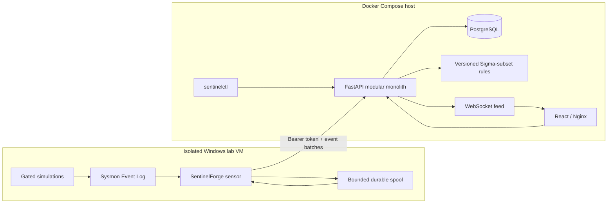

# Architecture

SentinelForge is a modular monolith around one durable event store. The boundary between the Windows sensor and the ingestion API is intentionally narrow: versioned JSON over authenticated HTTPS. Detection, correlation, alert construction, scenario bookkeeping, and investigation queries run in the API process so a lab deployment does not inherit an unnecessary message-broker or worker fleet.

## Request path

1. A sensor enrolls once with the operator-provided enrollment secret.
2. The API stores only a digest of the returned sensor token.
3. The sensor normalizes Sysmon XML, writes a batch to its local spool, and then submits it. Spooling before delivery avoids losing the batch on an interrupted request.
4. The API validates the envelope and every event, authenticates the sensor, and deduplicates by sensor/batch and sensor/event identifiers.
5. Committed events are evaluated by stateless rules and stateful correlations. Alerts reference immutable event evidence rather than copying mutable display data.
6. The API publishes a lightweight invalidation message to connected dashboards. The UI refetches authoritative records.
7. Timeline queries return a bounded graph of event, process, alert, and scenario nodes. Clustering is performed before rendering when a result set is large.

## Modules and ownership

| Boundary | Responsibility | Explicit non-responsibility |
|---|---|---|
| Windows sensor | Event Log reads, normalization, local durability, delivery | Rule decisions, running simulations |
| Ingestion | Authentication, limits, validation, idempotent persistence | Trusting sensor-supplied ATT&CK tags as detections |
| Detection engine | Deterministic supported Sigma subset | General Sigma backend compatibility |
| Correlation engine | Windowed sequences, thresholds, grouping, deduplication | Distributed stream processing |
| Scenario runner | Lab gate, dry-run, scoped changes, cleanup manifest | Offensive payload delivery or evasion |
| API/query layer | Triage views, exports, live notifications | Internet-facing multi-tenant service |
| Web dashboard | Investigation and scenario control | Security enforcement |

## Data model

PostgreSQL stores sensors, hosts, raw references, normalized events, process/network/file/registry projections, rules and versions, alerts and evidence, correlations, scenarios and runs, and ATT&CK techniques. Normalized event JSON is retained with indexed columns for frequently queried pivots. This is deliberate: projections make investigations predictable while the JSON document preserves schema evolution.

## Scaling boundary

The deployment is designed for a small isolated lab. A single API instance gives correlation deterministic in-process ordering. Multiple API replicas would require database advisory locks or an explicit event worker and ordered queue. That work is intentionally deferred rather than hidden behind a configuration flag.

## Deployment network

PostgreSQL is attached only to an internal Compose network. The API bridges the data and edge networks; the frontend is edge-only. Published ports bind to loopback unless the operator explicitly changes the address. The Windows VM reaches only the API port over a lab-only network.

See the decision records in [`adr/`](adr/) for the tradeoffs that shape this design.
